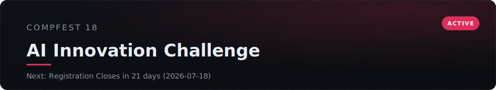
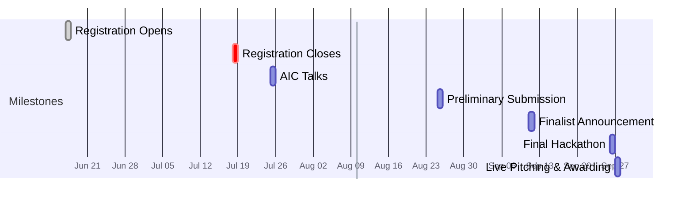

<!-- AUTO:START -->
<!-- Generated by scripts/render.py. Do not edit inside this block; edit competition.yml. -->

> Next milestone: **Registration Closes**, 8 days remaining (2026-07-18).

## Timeline

## Deliverables

- [ ] Public GitHub repo (README + docker compose)
- [ ] Proof-of-work video (unlisted, max 7 min)
- [ ] Promo video (public, max 5 min)
- [ ] Proposal PDF (max 20 pages)

## Resources

| Resource | Link |
| :--- | :--- |
| Registration | https://compfest.id/competition/aic |
| Event site | https://compfest.id |

Last updated 2026-07-10

<!-- AUTO:END -->

## Overview

COMPFEST is Indonesia's largest student-run technology festival, organized by
the Faculty of Computer Science at Universitas Indonesia. The **AI Innovation
Challenge (AIC)** is its applied-AI competition, run this year under the theme
**"AI for the Backbone of the Economy"** and the banner **#EncloseTheGap**: build
AI that strengthens the real sectors the economy runs on.

The competition has two rounds. An online **preliminary** round, where each team
ships a working MVP plus a proposal and two videos, then an on-site **final** in
Jakarta built around a 10-hour hackathon and live pitching.

Our team is **registered and scoping**. This repository is our context hub: the
rules, the rubric we build toward, our subtheme and project decisions, and links
to everything we produce.

> **Open decisions:** subtheme is not chosen and the project concept is not
> locked. See [Theme and subthemes](#theme-and-subthemes) and [Project](#project).

## Theme and subthemes

The work must sit under one of three pillars of the productive economy:

| Subtheme | Focus |
| :--- | :--- |
| **Smart Manufacturing** | AI for production, quality control, predictive maintenance, and industrial efficiency |
| **Smart Logistics** | AI for supply chains, routing, warehousing, demand forecasting, and distribution |
| **Smart Commerce** | AI for retail, marketplaces, pricing, customer experience, and SME enablement |

> **Our subtheme:** _to be decided._

## Prize pool

| Award | Prize |
| :--- | :--- |
| Champion | Rp 7,000,000 |
| 1st Runner-up | Rp 4,500,000 |
| 2nd Runner-up | Rp 2,500,000 |
| Best Student Team | Rp 1,000,000 |
| Audience Favorite | Rp 750,000 |

## What the judges reward

The preliminary score is built deliberately toward this rubric. Two categories,
**technical implementation (25%)** and **originality and social impact (20%)**,
carry nearly half the score, so the build must be genuinely sound and the idea
genuinely new. Two bonus categories push the ceiling above 100%.

| Criterion | Weight | What scores well |
| :--- | :---: | :--- |
| Technical implementation & architecture maturity | 25% | The right AI model, framework, and stack for the problem. Clean, efficient inference. A modular architecture with backend and frontend cleanly separated. A README good enough to understand the whole system |
| Originality & social impact | 20% | A genuinely novel approach not done before. An urgent, relevant problem with a clear user. Potential to scale to a real, even global, need |
| MVP readiness for the final | 15% | Scope set correctly, neither over- nor under-built. Covers the core functionality. An architecture flexible enough to extend at the final without a full rebuild |
| Promo video | 15% | Clearly communicates the problem and the solution. Tells the build story well. Speaks to stakeholders (government, industry). Complete per the rules |
| Proposal quality & development process | 15% | Complete structure per the template (methodology, dataset, integration). A rigorous, logical method. Justified technology, model, and architecture choices. Reflects a real iterative process |
| Relevance to the theme | 10% | The innovation genuinely fits a subtheme, and AI is essential to it rather than forced on top |
| Business value & governance _(bonus)_ | 3.5% | A credible business model and adoption path. Attention to AI regulation, ethics, and responsible use |
| AIC Talks _(bonus)_ | 1.5% | Attend and check in to the AIC Talks session |

## What to build

An applied-AI MVP under one subtheme, reproducible by the judges. Scope rules to
keep in mind:

- **AI is the core**, not an add-on. The model has to do real work in the product.
- **Right-size the MVP.** Build the core function well; leave deliberate room to
  extend at the final. Over-building before the final is penalized.
- **Reproducible repo.** Public GitHub repository with a clear README and a
  working `docker compose` so the whole system runs from a clean checkout.
- **Conventional Commits** are required across the repository history.
- **First 30 registered teams** receive a free VPS for development.
- **Top 8 teams** advance to the on-site final.

## Preliminary submission checklist

All four are required. The dashboard above tracks completion; notes on each:

1. **Public GitHub repository** — code, README, and `docker compose`, with a
   Conventional Commits history.
2. **Proof-of-work video** — max **7 minutes**, unlisted on YouTube. Shows the
   product actually working, by screen recording or camera.
3. **Promo video** — max **5 minutes**, public on YouTube, MP4 at least 720p.
   Title format: `COMPFEST 18 AIC: [Team Name] - [Project Name]`.
4. **Proposal PDF** — max **20 pages**, following the provided template.

## The final round

The top 8 teams attend in person in Jakarta. The round is mentoring, a hackathon,
and live pitching:

- **Final mentoring (Sep 20)** and **final technical meeting (Sep 22)**.
- **Hackathon (Sep 26)** — a **10-hour non-stop** on-site sprint, all finalists
  building at once, iterating the AI product against scheduled checkpoints.
- After the hackathon ends, **no further repository changes** are allowed.
- The product is demonstrated **locally (localhost)**, not cloud-deployed, at the
  **live pitching** session.
- Teams using **hardware** must register the devices at the final technical
  meeting, where they are checked against safety rules.
- **Awarding Night (Sep 27)** at the new Fasilkom UI building closes the event.

## Registration

| Batch | Window | Fee |
| :--- | :--- | :--- |
| Batch 1 | Jun 17 - Jul 9 | Free |
| Batch 2 | Jul 10 - Jul 18 | Rp 200,000 per team |

Teams are **3 to 5 members**, Indonesian. The first 30 registered teams get a
free VPS.

## Resources

| Resource | Link |
| :--- | :--- |
| Competition page | https://compfest.id/competition/aic |
| COMPFEST | https://compfest.id |
| AIC email | aic@compfest.id |
| General competition Discord | https://compfest.link/competitioncompfest18 |
| AIC Discord | https://compfest.link/discordaiccompfest18 |

## Project

Locked once the subtheme and concept are decided. Fill in:

- **Problem** — the specific economic-sector problem and who has it.
- **Approach** — the solution and why AI is essential to it.
- **Architecture** — model, data, backend, frontend, and how `docker compose`
  ties them together.
- **Demo** — screenshots, the proof-of-work recording, and the live link.

## Notes and decisions

A running log of decisions, rules to remember, mentor feedback, and open
questions.

- _2026-06-27_ — Tracker created. Registration window open; subtheme, project,
  and team pending.
